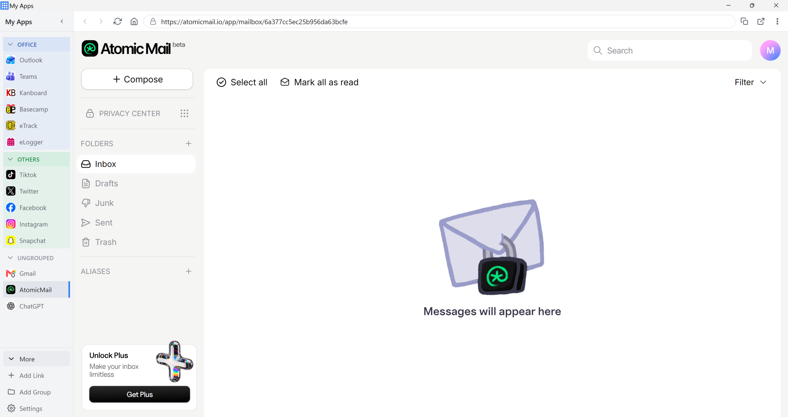

# My Apps

A lightweight desktop wrapper: add your own web links, group them, and get
per-link unread badges, desktop notifications, tray/taskbar indicators, and
true hibernation — without the memory cost of a framework-based shell or one
`<webview>` renderer per service.

No pre-made service templates. Every link is a URL you type in yourself.

## Features

- **Links & groups** — add any site as a link, organize into collapsible groups, drag to reorder.
- **Unread detection** — four signals (Badging API, tab title, favicon, a DOM-reading Expert rule), highest-trust-ever-seen wins per link.
- **Notifications** — real page notifications forwarded (Gmail, Slack, WhatsApp Web, Teams, etc.), plus synthesized ones for sites with no notification API of their own.
- **Hibernation** — fully closes a link's renderer to free memory, wakes it from disk-persisted cookies/localStorage.
- **Tray & taskbar** — tray icon, taskbar overlay/flash, aggregate unread count across all links.
- **Scroll arrows** — optional floating ▲/▼ buttons on every site (Settings → Appearance, off by default).
- **Userscripts** — your own JavaScript, run on pages matching a URL pattern.
- **Startup commands** — run any shell command in the background when the app starts (e.g. to launch a locally-hosted service).
- **Settings export/import** — one JSON file for links, groups, settings, userscripts, and commands.



## Running it

```
run.bat      # dev run — installs deps + generates icons on first run, then `electron .`
build.bat    # packages to dist/ as both an NSIS installer and a zip
create-shortcut.bat   # adds a Desktop shortcut to the packaged exe
```

**Important:** the dev run (`electron .`) and an installed/packaged build use
**different** `userData` folders. If you switch from `run.bat` to a packaged
build, you'll need to re-add your links (or use Settings → Data →
Export/Import to carry them over).

There's no silent auto-update — Settings → About checks the project's GitHub
releases and shows a **Download** button when a newer version exists, which
opens the release page in your default browser.

### Dev auto-reload

While running via `run.bat`, editing and saving a source file reloads or
restarts the app automatically (`src/main/devReload.js`) — never runs in a
packaged build:

- `src/renderer/**` → the shell window reloads.
- `preload/link-preload.js` / `preload/inject-main-world.js` → every open
  site reloads.
- `main.js` / `src/main/**` → the whole app restarts.

This is a full reload, not state-preserving HMR — there's no bundler here.

## Architecture in one paragraph

One `BrowserWindow` hosts the shell (sidebar + toolbar, plain HTML/CSS/ES
modules, no framework) as its own page, plus one `WebContentsView` per
*loaded* link, each on its own `persist:link-<id>` session partition so
multiple accounts on the same service (two Gmail logins, say) don't collide.
Hibernating a link fully closes its renderer process and frees the memory;
waking it reloads from the still-persisted cookies/localStorage on disk.

## Unread detection

Four signals, highest-trust-ever-seen wins forever after (per link):

1. **Expert rule** — a DOM rule you write yourself (see cookbook below).
2. **Badging API** — `navigator.setAppBadge()`/`clearAppBadge()`, patched in the page's main world. Most modern web apps call this natively.
3. **Tab title** — patterns like `(3) Inbox`.
4. **Favicon** — best-effort keyword tier (`unread`/`alert`/`new` vs `seen`/`read`), boolean only.

The edit dialog's "Unread & Hibernation" tab shows a live
**"currently reading: `source` → `value`"** readout so you always know which
signal is actually driving the badge.

## Expert rule cookbook

An expert rule reads a value out of the live DOM. Fields:

| Field | Meaning |
|---|---|
| `selector` | CSS selector for the element(s) to read |
| `source` | `text` (textContent), `attr` (an attribute), `count` (number of matches), or `value` (form input value) |
| `attr` | attribute name, only used when `source: "attr"` |
| `regex` | applied to the raw value; **capture group 1** is the count |
| `mode` | `number` (parse a count) or `presence` (just "has unread or not") |
| `aggregate` | when the selector matches multiple elements: `first`, `sum`, or `max` |
| `intervalMs` | safety-net poll interval; the primary trigger is a `MutationObserver` |

Use the **Pick element** button to click something on the page and
auto-fill the selector, then **Test** to see what it currently reads.

### Worked example: Outlook Web

Outlook shows the true unread count in the Inbox row's `title` attribute,
e.g. `title="Inbox - 18,063 items (1 unread)"`. This is more reliable than
the tab title (Outlook doesn't update it) or the favicon (doesn't change for
new mail):

```jsonc
{
  "selector": "[role=\"treeitem\"][title]",
  "source": "attr",
  "attr": "title",
  "regex": "\\((\\d+)\\s*unread\\)",
  "mode": "number",
  "aggregate": "sum",
  "intervalMs": 15000
}
```

This is the same approach `DesktopApps/MyOutlook` hard-codes, turned into
data you can point at any service.

### Tips

- Start broad with `source: "count"` and `mode: "presence"` just to confirm
  the selector matches anything at all, then narrow down.
- If a selector matches many elements you don't want, make it more specific
  (add a parent class, an `[aria-label]`, etc.) rather than relying on
  `aggregate` to save you.
- Invalid CSS selectors and invalid regexes fail safely — the Test button
  reports `✗` instead of throwing.

## Notifications

Two paths, both required for broad compatibility:

- **Path A — forwarded from the page.** `window.Notification` is replaced
  with a shim, and `ServiceWorkerRegistration.prototype.showNotification` is
  patched too — most modern PWAs (Gmail, WhatsApp Web, Teams) use the
  service-worker path exclusively, not `window.Notification` directly.
- **Path B — synthesized from unread increases**, generalized from
  MyOutlook's behavior. Automatically suppressed once a link has ever sent a
  real page notification (Path A), so Slack doesn't announce everything
  twice.

## Site page extras

- **Scroll arrows** (Settings → Appearance, off by default) — floating
  ▲/▼ buttons injected into every open site, inside a closed shadow root so
  the site's own CSS/JS can never touch them. Hidden until the page
  scrolls, then fade out again after ~1.2s idle. Only affects window-level
  scrolling — sites that scroll an inner div (Gmail, Slack) may not respond.
- **Userscripts** (Settings → Userscripts) — your own JavaScript, run once
  per page load on sites matching a pattern (`*` wildcard). Each script gets
  its own top-level `webFrame.executeJavaScript()` call from
  `preload/link-preload.js`, not a nested `eval()`/`Function()` — sites with
  a strict CSP (Gmail, ChatGPT) block the nested form. Editing a script
  takes effect on the next load/reload, not live.

## Startup commands

Settings → Commands runs any shell command in the background, non-blocking,
every time the app starts (`src/main/startupCommands.js`, fire-and-forget
`child_process.spawn`). Meant for starting something My Apps then points a
link at — e.g. a locally-hosted webmail client.

## Hibernation

Hibernating fully closes the link's renderer (`removeChildView` +
`webContents.close()`) — verify this actually frees the process in Task
Manager if you change this code. A hibernated link **cannot report
anything**, so:

- `keepAwake` defaults to `true` — hibernation and monitoring are honestly
  mutually exclusive unless you opt out.
- The edit dialog shows a warning the moment a link's policy would let it
  hibernate while still tracking unread/notifications, with a one-click fix.
- A hibernated link's last known count is kept but marked **stale** —
  excluded from the taskbar aggregate/flash, shown as a dimmed "zZ" pill.

## Troubleshooting

- **Packaged notifications show as "electron.app.Electron"** — make sure
  `app.setAppUserModelId()` in `main.js` matches `build.appId` in
  `package.json`; it already does, but if you rename the app, update both.
- **Windows Focus Assist** can silently suppress all OS notifications
  regardless of the app's own DND setting — check it if notifications seem
  to vanish.
- **Google sign-in blocks the window** — Chromium's default UA contains
  `Electron/`, which Google blocks. Sessions strip that automatically; if a
  specific service still blocks you, set a custom User-Agent on that link
  (General tab → Advanced).
- **A link keeps crashing** — after 2 automatic reload attempts within a
  minute, My Apps stops auto-reloading it and shows an error pill; reload it
  manually once whatever's wrong is fixed.
- **Corrupt `store.json`** — it's renamed to `store.corrupt-<timestamp>.json`
  next to the original and the app starts fresh with a toast; nothing is
  silently lost.

## Memory

Settings → Performance shows a live per-process memory table
(`app.getAppMetrics()`). Expect roughly one renderer process per *loaded*
link, plus the shell.
