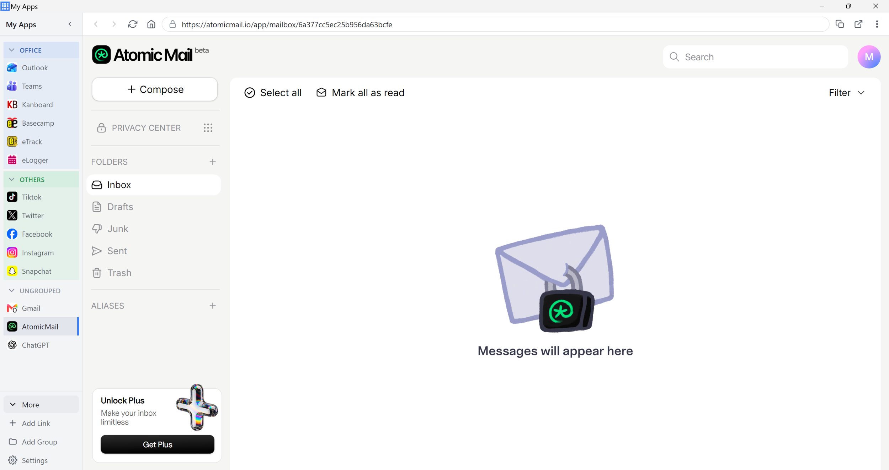

# My Apps

A lightweight desktop wrapper: add your own web links, group them, and get
per-link unread badges, desktop notifications, tray/taskbar indicators, and
true hibernation — without the memory cost of a framework-based shell or one
`<webview>` renderer per service.

No pre-made service templates. Every link is a URL you type in yourself.

## Features

- **Links & groups** — add any site as a link, organize into collapsible groups, drag to reorder.
- **Unread detection** — four signals (Badging API, tab title, favicon, a DOM-reading Expert rule), highest-trust-ever-seen wins per link.
- **Notifications** — real page notifications forwarded (Gmail, Slack, WhatsApp Web, Teams, etc.), plus synthesized ones for sites with no notification API of their own.
- **Hibernation** — fully closes a link's renderer to free memory, wakes it from disk-persisted cookies/localStorage.
- **Tray & taskbar** — tray icon, taskbar overlay/flash, aggregate unread count across all links.
- **Scroll arrows** — optional floating ▲/▼ buttons on every site (Settings → Appearance, off by default).
- **Ad & tracker blocking** — on by default for every link (Ghostery adblocker); turn it off per link in Edit → Advanced.
- **Ctrl+Tab link switcher** — press Ctrl+Tab to see every link as cards: keep pressing Tab to move (Shift+Tab goes back), let go of Ctrl to switch; on by default, turn it off in Settings → Features.
- **Dark mode** — moon/sun button in the toolbar forces a dark look on the current link; remembered per link across restarts.
- **Keyword highlighter** — highlighter button in the toolbar; one global list of words, highlighted automatically on every page (including pages that change after load). Each keyword needs at least 3 characters. Empty list = off.
- **WhatsApp extras** — on any web.whatsapp.com link: blur names/photos/messages, hide online status, view statuses privately, restore deleted messages, online notifications, chat with a number not in your contacts. Chosen per link from a toolbar button that shows only on WhatsApp.
- **Userscripts** — your own JavaScript, run on pages matching a URL pattern.
- **Startup commands** — run any shell command in the background when the app starts (e.g. to launch a locally-hosted service).
- **Settings export/import** — one JSON file for links, groups, settings, userscripts, and commands.



## Running it

```
run.bat      # dev run — installs deps + generates icons on first run, then `electron .`
build.bat    # packages to dist/ as both an NSIS installer and a zip
create-shortcut.bat   # adds a Desktop shortcut to the packaged exe
```

**Important:** the dev run (`electron .`) and an installed/packaged build use
**different** `userData` folders. If you switch from `run.bat` to a packaged
build, you'll need to re-add your links (or use Settings → Data →
Export/Import to carry them over).

There's no silent auto-update — Settings → About checks the project's GitHub
releases and shows a **Download** button when a newer version exists, which
opens the release page in your default browser.

### Dev auto-reload

While running via `run.bat`, editing and saving a source file reloads or
restarts the app automatically (`src/main/devReload.js`) — never runs in a
packaged build:

- `src/renderer/**` → the shell window reloads.
- `preload/link-preload.js` / `preload/inject-main-world.js` → every open
  site reloads.
- `main.js` / `src/main/**` → the whole app restarts.

This is a full reload, not state-preserving HMR — there's no bundler here.

## Architecture in one paragraph

One `BrowserWindow` hosts the shell (sidebar + toolbar, plain HTML/CSS/ES
modules, no framework) as its own page, plus one `WebContentsView` per
*loaded* link, each on its own `persist:link-<id>` session partition so
multiple accounts on the same service (two Gmail logins, say) don't collide.
Hibernating a link fully closes its renderer process and frees the memory;
waking it reloads from the still-persisted cookies/localStorage on disk.

## Unread detection

Four signals, highest-trust-ever-seen wins forever after (per link):

1. **Expert rule** — a DOM rule you write yourself (see cookbook below).
2. **Badging API** — `navigator.setAppBadge()`/`clearAppBadge()`, patched in the page's main world. Most modern web apps call this natively.
3. **Tab title** — patterns like `(3) Inbox`.
4. **Favicon** — best-effort keyword tier (`unread`/`alert`/`new` vs `seen`/`read`), boolean only.

The edit dialog's "Unread & Hibernation" tab shows a live
**"currently reading: `source` → `value`"** readout so you always know which
signal is actually driving the badge.

## Expert rule cookbook

An expert rule reads a value out of the live DOM. Fields:

| Field | Meaning |
|---|---|
| `selector` | CSS selector for the element(s) to read |
| `source` | `text` (textContent), `attr` (an attribute), `count` (number of matches), or `value` (form input value) |
| `attr` | attribute name, only used when `source: "attr"` |
| `regex` | applied to the raw value; **capture group 1** is the count |
| `mode` | `number` (parse a count) or `presence` (just "has unread or not") |
| `aggregate` | when the selector matches multiple elements: `first`, `sum`, or `max` |
| `intervalMs` | safety-net poll interval; the primary trigger is a `MutationObserver` |

Use the **Pick element** button to click something on the page and
auto-fill the selector, then **Test** to see what it currently reads.

### Worked example: Outlook Web

Outlook shows the true unread count in the Inbox row's `title` attribute,
e.g. `title="Inbox - 18,063 items (1 unread)"`. This is more reliable than
the tab title (Outlook doesn't update it) or the favicon (doesn't change for
new mail):

```jsonc
{
  "selector": "[role=\"treeitem\"][title]",
  "source": "attr",
  "attr": "title",
  "regex": "\\((\\d+)\\s*unread\\)",
  "mode": "number",
  "aggregate": "sum",
  "intervalMs": 15000
}
```

This is the same approach `DesktopApps/MyOutlook` hard-codes, turned into
data you can point at any service.

### Tips

- Start broad with `source: "count"` and `mode: "presence"` just to confirm
  the selector matches anything at all, then narrow down.
- If a selector matches many elements you don't want, make it more specific
  (add a parent class, an `[aria-label]`, etc.) rather than relying on
  `aggregate` to save you.
- Invalid CSS selectors and invalid regexes fail safely — the Test button
  reports `✗` instead of throwing.

## Notifications

Two paths, both required for broad compatibility:

- **Path A — forwarded from the page.** `window.Notification` is replaced
  with a shim, and `ServiceWorkerRegistration.prototype.showNotification` is
  patched too — most modern PWAs (Gmail, WhatsApp Web, Teams) use the
  service-worker path exclusively, not `window.Notification` directly.
- **Path B — synthesized from unread increases**, generalized from
  MyOutlook's behavior. Automatically suppressed once a link has ever sent a
  real page notification (Path A), so Slack doesn't announce everything
  twice.

## Site page extras

- **Scroll arrows** (Settings → Appearance, off by default) — floating
  ▲/▼ buttons injected into every open site, inside a closed shadow root so
  the site's own CSS/JS can never touch them. Hidden until the page
  scrolls, then fade out again after ~1.2s idle. Only affects window-level
  scrolling — sites that scroll an inner div (Gmail, Slack) may not respond.
- **Userscripts** (Settings → Userscripts) — your own JavaScript, run once
  per page load on sites matching a pattern (`*` wildcard). Each script gets
  its own top-level `webFrame.executeJavaScript()` call from
  `preload/link-preload.js`, not a nested `eval()`/`Function()` — sites with
  a strict CSP (Gmail, ChatGPT) block the nested form. Editing a script
  takes effect on the next load/reload, not live.

## Ad & tracker blocking

On by default for every link, including links saved before the feature
existed. Turn it off for one link with Edit → Advanced → "Block ads and
trackers" (`navigation.blockAds`). Uses `@ghostery/adblocker-electron`, set up
per link session in `src/main/adblock.js`.

- It blocks network requests to known ad/tracker hosts and hides ad boxes on
  the page.
- The filter lists download on first use and are cached in the app data
  folder (`adblock-engine.bin`). Until that first download ends, pages may
  show ads. If the download fails, links still work, just unblocked.
- Changing the setting takes effect the next time the link loads.
- Most YouTube video ads are not blocked.
- The blocker's in-page "scriptlets" (scripts that rewrite a site's own code)
  are turned off (`RUN_PAGE_SCRIPTLETS` in `src/main/adblock.js`): on Facebook
  they clashed with each other and could trigger "Something went wrong".
- A site breaks (e.g. Facebook shows "Something went wrong")? Turn blocking
  off for that link in Edit → Advanced to confirm. To find the one rule at
  fault, start the app with `MYAPPS_ADBLOCK_LOG=1` (PowerShell:
  `$env:MYAPPS_ADBLOCK_LOG=1; npm start`): every blocked request is printed
  with the filter that matched. Then add an exception such as
  `'@@||example.com/path^'` to `EXCEPTIONS` in `src/main/adblock.js`.
- Disposable check: `scripts/adblock-smoke.js` (run it with the Electron
  binary in `node_modules/electron/dist`; needs internet).

## WhatsApp extras

While a link is on `web.whatsapp.com` (standard or Business), a toolbar button
(eye-off icon) appears. It opens a dialog with the options below. They are saved
on that link and apply at once, so two WhatsApp links keep separate choices. The
button is hidden on every other site. `preload/whatsapp-main-world.js` is
injected only on WhatsApp.

- **Blur** contact names, photos, conversation messages and recent messages
  (CSS only; blur clears while the pointer is over it).
- **Hide online status**, **view statuses privately** —
  these replace the matching functions inside WhatsApp's own code.
- There is no "hide blue ticks" option, on purpose. It cannot work from inside
  an app: WhatsApp only hides read receipts if the account's own "Read receipts"
  privacy setting is off, and blocking them instead leaves chats unread on
  your phone. Use WhatsApp's own privacy setting for that.
- **Restore deleted messages** — copies of incoming text messages are kept in
  memory only, so only messages received while the app was open can be
  restored, and nothing survives a restart. The original text shows under the
  deleted message.
- **Notify when a contact comes online** — desktop notification for the
  contacts you list (a name or a phone number per line).
- **Chat with a number** — opens a chat with a phone number that is not in
  your contacts.
- **Make sidebar resizable** — drag the right edge of the chat list to change
  its width; double-click the edge to go back to WhatsApp's own width. The width
  is saved per link and kept across restarts. The chat always keeps room to show.

WhatsApp renames its internal code and page markup from time to time. The
blur selectors (`BLUR_SELECTORS`) and module lookups can then stop working; an
option that cannot attach shows "Not available in this version of WhatsApp Web".
Hiding read receipts or presence may go against WhatsApp's terms; use at your own
risk.

## Ctrl+Tab link switcher

Press **Ctrl+Tab** while a My Apps window is in front to see a card for every
link. Awake links come first, then asleep ones, each A to Z. Each card has the
sidebar's status icon (moon = asleep, red number = unread, green dot = loaded);
the link you are on is tagged "Current" and is the one highlighted when it opens.

- Keep holding Ctrl and press **Tab** to move to the next card, **Shift+Tab** to
  the previous one. The arrow keys move too, and holding Tab keeps moving.
- **Let go of Ctrl** to switch to the highlighted link. **Enter** does the same.
- **Esc**, a click outside the cards, or leaving the window closes it without
  switching. Clicking a card switches.

Settings → Features → "Ctrl+Tab link switcher" turns it off (on by default).

- It only works while My Apps has keyboard focus. A system-wide version would
  need a global keyboard hook, which sees every key typed in every program, so
  it was left out on purpose.
- The cards are a separate transparent view on top of the page
  (`src/main/switcherOverlay.js`, `src/renderer/switcher.html`). The page behind
  is not hidden. Ctrl+Tab itself is caught on the window; once the cards are
  open they take the keyboard focus and send every key press and release back to
  the app. That is deliberate: when the app swallows a key press, Chromium also
  drops the matching key release, so the release of Ctrl never arrived and
  switching waited for a timer. Keys handled by a page are not dropped, so the
  release now switches at once. (Hiding the page instead made Chromium fake a key
  release.)
- Safety net: if the release of Ctrl is somehow never delivered, 2 seconds with
  no key event at all counts as letting go. Holding Ctrl keeps repeating its key
  press, so holding never triggers it.
- To see which key events reach the app, start it with `MYAPPS_KEYDBG=1`
  (PowerShell: `$env:MYAPPS_KEYDBG=1; npm start`): Ctrl, Tab, arrow, Enter and
  Esc events are printed as `[switcher-keys]` lines. Nothing else is logged.

## Sidebar privacy options

Both are in Settings → Features → Sidebar, and both are off by default.

- **Blur links in the sidebar** — link names and icons are blurred. They clear
  while the mouse is over the sidebar and blur again when it leaves. Unread
  counts and status icons stay readable.
- **Hide the sidebar until the mouse goes far left** — the sidebar goes out of
  sight and the pages use the full window width. Move the mouse to the far left
  edge of the window to bring it back; it hides again about a third of a second
  after the mouse moves away (and at once when the window loses focus, a dialog
  opens, the app locks or the Ctrl+Tab switcher shows). This is separate from
  the collapse button, and they work together: a collapsed sidebar comes back
  collapsed. The sidebar floats over the page, so the page keeps its size and is
  not redrawn. It is a second copy of the sidebar page
  (`index.html?sidebar=1`, `src/main/sidebarOverlay.js`) that gets the same state
  as the main window. Buttons that need a dialog (Add Link, Add Group, Settings,
  edit group) hide it and open the dialog in the main window. The mouse is read
  from the screen, not from the page, because a page covers the left edge while
  the sidebar is hidden.

## Startup commands

Settings → Commands runs any shell command in the background, non-blocking,
every time the app starts (`src/main/startupCommands.js`, fire-and-forget
`child_process.spawn`). Meant for starting something My Apps then points a
link at — e.g. a locally-hosted webmail client.

## Hibernation

Hibernating fully closes the link's renderer (`removeChildView` +
`webContents.close()`) — verify this actually frees the process in Task
Manager if you change this code. A hibernated link **cannot report
anything**, so:

- Links never hibernate on their own by default (policy "Manual only"); you
  hibernate one yourself, or leave "open on startup" off so it never loads.
  A hibernated link is simply off — no notifications, no memory — until you
  open it.
- `keepAwake` defaults to `true` — hibernation and monitoring are honestly
  mutually exclusive unless you opt out.
- The edit dialog shows a warning the moment a link's policy would let it
  hibernate while still tracking unread/notifications, with a one-click fix.
- A hibernated link's last known count is kept but marked **stale** —
  excluded from the taskbar aggregate/flash, shown as a dimmed "zZ" pill.

## Troubleshooting

- **Packaged notifications show as "electron.app.Electron"** — make sure
  `app.setAppUserModelId()` in `main.js` matches `build.appId` in
  `package.json`; it already does, but if you rename the app, update both.
- **Windows Focus Assist** can silently suppress all OS notifications
  regardless of the app's own DND setting — check it if notifications seem
  to vanish.
- **Google sign-in blocks the window** — Chromium's default UA contains
  `Electron/`, which Google blocks. Sessions strip that automatically; if a
  specific service still blocks you, set a custom User-Agent on that link
  (General tab → Advanced).
- **A link keeps crashing** — after 2 automatic reload attempts within a
  minute, My Apps stops auto-reloading it and shows an error pill; reload it
  manually once whatever's wrong is fixed.
- **Corrupt `store.json`** — it's renamed to `store.corrupt-<timestamp>.json`
  next to the original and the app starts fresh with a toast; nothing is
  silently lost.

## Memory

Settings → Performance shows a live per-process memory table
(`app.getAppMetrics()`). Expect roughly one renderer process per *loaded*
link, plus the shell.
